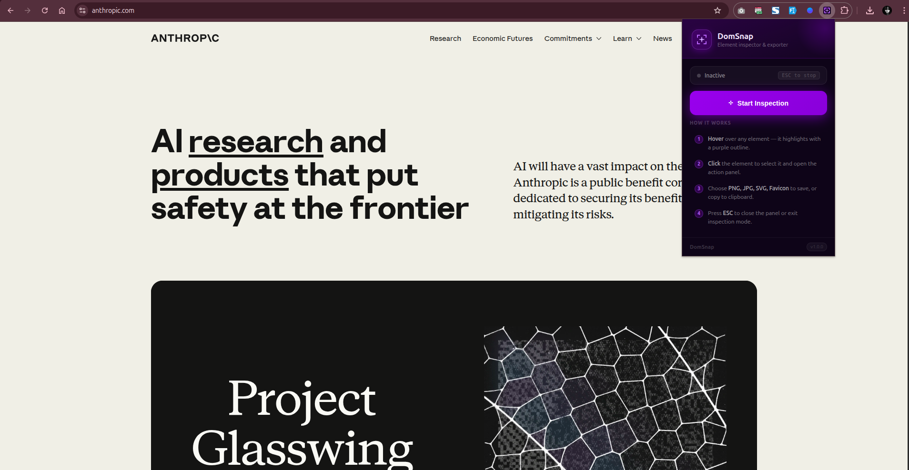
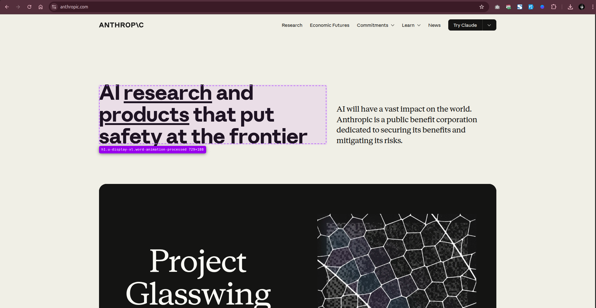

# DomSnap

A Chrome extension that lets you hover over any element on a webpage, select it, and instantly export it as **PNG**, **JPG**, **SVG**, or a **favicon** — with a one-click copy-to-clipboard option.



---

## Features

- **Hover Inspection** — Dashed animated highlight follows your cursor across any element, showing the tag name, class, and live dimensions
- **Click to Capture** — Select any element with a click; a sleek floating panel appears with export options
- **Multiple Export Formats** — PNG, JPG, SVG (with inlined computed styles), and 32×32 Favicon PNG
- **Copy to Clipboard** — Copies the element as a PNG image directly to your clipboard
- **Smart Panel Positioning** — The action panel auto-places itself near the selected element and stays within the viewport
- **Draggable Panel** — Grab the panel header and reposition it anywhere on screen
- **Auto-close** — Panel dismisses automatically after a download starts
- **ESC to exit** — Press ESC to close the panel and keep inspecting, or ESC again to fully exit
- **Shadow DOM UI** — Extension UI never inherits or pollutes the host page's styles



---

## Installation

> This extension is not on the Chrome Web Store. Load it manually in developer mode.

### Step 1 — Generate Icons

Open `create-icons.html` in Chrome (drag it into a tab), click **Generate & Download Icons**, and move the 4 downloaded PNGs into the `icons/` folder.

> If you cloned this repo, the icons are already included — skip this step.

### Step 2 — Load the Extension

1. Open Chrome and go to `chrome://extensions`
2. Enable **Developer mode** (toggle in the top-right corner)
3. Click **Load unpacked**
4. Select the `dom-snap/` folder
5. The DomSnap icon appears in your toolbar

---

## Usage

| Step | Action |
|------|--------|
| 1 | Click the **DomSnap icon** in the Chrome toolbar |
| 2 | Click **Start Inspection** — the popup closes and inspection begins |
| 3 | **Hover** over any element — a dashed purple outline tracks it |
| 4 | **Click** the element to lock selection and open the export panel |
| 5 | Choose **PNG**, **JPG**, **SVG**, or **ICO** to download |
| 6 | Or click **Copy to Clipboard** to copy as PNG |
| 7 | Press **ESC** to dismiss the panel or exit inspection mode |

---

## Export Formats

| Format | Description |
|--------|-------------|
| **PNG** | Lossless screenshot crop of the element |
| **JPG** | Compressed screenshot crop |
| **SVG** | DOM-serialized vector with inlined computed styles |
| **ICO** | 32×32 PNG named `favicon.png`, ready to drop into any project |
| **Clipboard** | Copies element as PNG to system clipboard |

---

## File Structure

```
dom-snap/
├── manifest.json       # MV3 extension manifest
├── background.js       # Service worker — screen capture & downloads
├── content.js          # Injected inspector UI (Shadow DOM panel)
├── content.css         # Highlight overlay & toast styles
├── popup.html          # Toolbar popup
├── popup.css
├── popup.js
└── icons/
    ├── icon16.png
    ├── icon32.png
    ├── icon48.png
    └── icon128.png
```

---

## Permissions

| Permission | Why |
|------------|-----|
| `activeTab` | Access the current tab for screen capture |
| `tabs` | Call `captureVisibleTab` from the background |
| `downloads` | Trigger file downloads reliably via `chrome.downloads` |
| `scripting` | Inject the content script on demand |
| `clipboardWrite` | Write PNG images to the clipboard |
| `<all_urls>` | Allow inspection on any website |

---

## Tech Notes

- Built with **Manifest V3**
- Uses `createImageBitmap` + `OffscreenCanvas` in the service worker (no DOM access in MV3 workers)
- Downloads routed through `chrome.downloads.download()` — the only reliable download path from a Chrome extension
- Panel is rendered in a **closed Shadow DOM** to prevent style leakage in both directions
- SVG export serialises computed styles inline via `getComputedStyle` for accurate reproduction

---

## License

MIT
